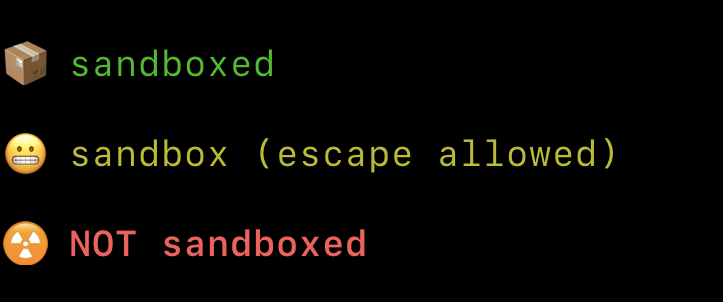

# boxed


**Is Claude Code actually sandboxed right now?** `boxed` answers that in one
glance. It prints the effective Claude Code sandbox status as a short, colored
label — green when you're boxed in, red when you're not.

<div align="center">
<picture>
  <source media="(prefers-color-scheme: dark)" srcset="docs/boxed-logo-dark.png">
  
</picture>
</div>

## Why you want this

Claude Code's sandbox setting is resolved from up to four different places —
organization policy, project settings, local overrides, your user config — and
any of them can quietly flip it. When an agent is about to run commands on your
machine, "am I sandboxed?" is exactly the kind of thing you want on your
statusline, not something you rediscover by reading four JSON files in the right
order.

`boxed` does that resolution for you and prints a single, glanceable label. It
is a **building block, not a statusline**: it writes one line to stdout and
exits. Something else — [starship](https://starship.rs/),
[cship.dev](https://cship.dev/), or a shell script — owns the statusline and
calls `boxed` for the sandbox segment.

## The three states

There are exactly three states, and the same three tokens — `on`, `partial`,
`off` — name them everywhere: in the resolved label, in the
`--on/--partial/--off` flags, and in `boxed state`.

| State | Meaning |
| --- | --- |
| `on` | sandbox enabled **and** unsandboxed commands disallowed |
| `partial` | enabled, but unsandboxed commands allowed (the schema default) |
| `off` | disabled or unset |

Each state renders as a colored label. The defaults are exactly what you get by
running `boxed` with the format flags below — and passing your own is the
primary way to use the tool:

```sh
boxed \
  --on '[📦 sandboxed](green)' \
  --partial '[😬 sandbox (escape allowed)](yellow)' \
  --off '[☢️ NOT sandboxed](bold red)'
```

## Quickstart

Install it with [mise](https://mise.jdx.dev/) (see [Installation](#installation)
for every other method):

```sh
mise use -g github:jamestelfer/boxed
```

Run it from a project directory, so it can see that project's settings:

```console
$ boxed
📦 sandboxed
```

Then drop it into whatever renders your statusline. The simplest wiring is a
shell snippet that calls `boxed` for the sandbox segment:

```sh
printf '%s  %s\n' "$(boxed)" "${PWD##*/}"
```

That's the whole tool. The rest of this document covers customization, real
statusline recipes, and how the resolution actually works.

## Configuration

Each state's label is a [starship-style](https://starship.rs/config/#style-strings)
format string, overridable per state with `--on`, `--partial`, and `--off`. Only
the flag matching the **resolved** state has any effect; the others are ignored,
and any omitted flag keeps its default.

```sh
# Custom text labels tuned for a cramped statusline
boxed \
  --on '[boxed](green)' \
  --partial '[boxed: escapable](yellow)' \
  --off '[UNBOXED](bold red)'
```

Style only earns its keep on text. An emoji already carries its own colour and
meaning, so wrapping a bare emoji in a style adds nothing — prefer `--off '☢️'`
over `--off '[☢️](red)'`.

A format string is literal text plus `[text](style)` groups — no nesting, no
variables. Style tokens: `bold`, `italic`, `underline`, `dimmed`, `inverted`,
`strikethrough`. Colors as a name (`red`), a `bright-` name (`bright-red`), an
`fg:`/`bg:` prefix, a `#rrggbb` hex value, or a `0`–`255` palette number. A
malformed format string exits non-zero with a diagnostic naming the input.

**Colors are always emitted.** `boxed` does not consult `NO_COLOR`, `CLICOLOR`,
`FORCE_COLOR`, or whether stdout is a TTY — it prints the ANSI you asked for,
every time. If the consumer needs plain text, it should strip color itself, or
use `boxed state`.

## Using it in a statusline

`boxed` is a segment provider — it emits one styled label and exits. Wire it
into whatever owns your statusline.

> **Note:** `boxed` does **not** read stdin. Claude Code hands its `statusLine`
> command a JSON blob on stdin (session, model, cwd, …); `boxed` ignores it and
> resolves the sandbox state from settings files itself. So pointing Claude
> Code's `statusLine` directly at `boxed` would replace your entire statusline
> with just the sandbox segment. Compose it into a statusline that reads that
> stdin and owns the line — the recipes below.

### starship (and cship.dev)

Both consume the same starship configuration: [starship](https://starship.rs/)
renders it through its Claude Code statusline integration, and
[cship.dev](https://cship.dev/) falls through to your `starship.toml`. Add a
[`custom`](https://starship.rs/config/#custom-commands) module that runs `boxed`
and passes its already-styled output straight through (append your own
`--on/--partial/--off` to override the defaults):

```toml
# ~/.config/starship.toml
[custom.sandbox]
command = "boxed"
when = true
format = "$output "
shell = ["bash", "--noprofile", "--norc"]
```

### Claude Code statusLine wrapper

Without starship, follow the [Claude Code statusline
docs](https://code.claude.com/docs/en/statusline) and point `statusLine` at your
own script. The script reads Claude's JSON on stdin (keeping model, cwd, and the
rest) and calls `boxed` for the sandbox segment:

```bash
#!/usr/bin/env bash
# ~/.claude/statusline.sh
input=$(cat)
model=$(printf '%s' "$input" | jq -r '.model.display_name')
dir=$(printf '%s' "$input" | jq -r '.workspace.current_dir')

printf '[%s] 📁 %s  %s\n' "$model" "${dir##*/}" "$(boxed)"
```

```json
{ "statusLine": { "type": "command", "command": "~/.claude/statusline.sh" } }
```

### Shell scripts

Anything that builds a prompt or statusline can shell out to `boxed` and drop the
styled output straight in — pass `--on/--partial/--off` to override any label:

```sh
printf '%s  %s\n' "$(boxed --off '[UNBOXED](bold red)')" "${PWD##*/}"
```

If you'd rather branch on the state yourself — changing surrounding text rather
than the label — read the bare token from `boxed state`:

```sh
case "$(boxed state)" in
  off)     printf '⚠️  no sandbox' ;;
  partial) printf 'sandbox (escapable)' ;;
  on)      printf 'sandboxed' ;;
esac
```

## Installation

Every release ships provenance-attested archives, a self-contained install
script, and a Homebrew cask. All download paths can be verified — see
[Verifying releases](#verifying-releases).

<details>
<summary><strong>mise (recommended)</strong></summary>

[mise](https://mise.jdx.dev/) installs directly from GitHub Releases via the
[GitHub backend](https://mise.jdx.dev/dev-tools/backends/github.html):

```sh
mise use -g github:jamestelfer/boxed
```

</details>

<details>
<summary><strong>Install script</strong></summary>

Each release ships a self-contained installer (generated with
[binstaller](https://github.com/binary-install/binstaller)) that detects your
platform and checks the download against checksums embedded in the script — no
separate checksum file is fetched:

```sh
curl -fsSL https://github.com/jamestelfer/boxed/releases/latest/download/install.sh | sh
```

It installs to `~/.local/bin`; pass `-b` for another directory and a tag to pin
a version:

```sh
curl -fsSL https://github.com/jamestelfer/boxed/releases/latest/download/install.sh \
  | sh -s -- -b /usr/local/bin v0.1.0
```

The script carries a build-provenance attestation, so you can verify it before
running it (see [Verifying releases](#verifying-releases)). This transitively
covers the binary too: a verified script is guaranteed to hold the genuine
checksums it then enforces on the download.

```sh
curl -fsSL -O https://github.com/jamestelfer/boxed/releases/latest/download/install.sh
gh attestation verify install.sh --repo jamestelfer/boxed
sh install.sh
```

</details>

<details>
<summary><strong>Homebrew (macOS)</strong></summary>

```sh
brew install jamestelfer/tap/boxed
```

</details>

<details>
<summary><strong>Manual download</strong></summary>

Grab the archive for your platform from the
[latest release](https://github.com/jamestelfer/boxed/releases/latest)
(`boxed_<os>_<arch>.tar.gz`, or `.zip` on Windows), verify its provenance, then
extract:

```sh
gh attestation verify boxed_linux_amd64.tar.gz --repo jamestelfer/boxed
tar -xzf boxed_linux_amd64.tar.gz
```

Move the extracted `boxed` binary somewhere on your `$PATH`. See
[Verifying releases](#verifying-releases) for details.

</details>

<details>
<summary><strong>Build from source</strong></summary>

Requires Go 1.26 (pinned via [mise](https://mise.jdx.dev)):

```sh
mise install      # installs go 1.26 from mise.toml
just build        # produces dist/boxed
```

Add `dist/boxed` to your `$PATH`, or install wherever suits.

</details>

## Verifying releases

Every published archive, the `install.sh` script, and `checksums.txt` carry a
[SLSA build-provenance](https://slsa.dev/) attestation, signed keylessly through
[Sigstore](https://www.sigstore.dev/) during the release workflow. Verify any
artifact with an authenticated [GitHub CLI](https://cli.github.com/):

```sh
gh attestation verify "$ARTIFACT" --repo jamestelfer/boxed
```

A successful verification proves the artifact was built by this repository's
release workflow and has not been altered since.

## Commands

```text
boxed              # print the styled label for the resolved state
boxed state        # print the bare token: on | partial | off (unstyled)
boxed doctor       # print the resolved state and which settings source it came from
boxed --version    # print the embedded version
boxed --help       # usage
```

### `boxed`

Resolves the state and prints the styled label. This is what your statusline
calls. Customize the label with `--on/--partial/--off` (see
[Configuration](#configuration)).

### `boxed state`

Prints the bare token — `on`, `partial`, or `off` — with no styling. Use it in
scripts and in `when` guards to branch on the state without parsing a colored
label.

### `boxed doctor`

Prints the resolved state plus provenance — invaluable when the reported state
isn't what you expected. When the managed tier decided the outcome, `doctor`
reports that as a single unit (the managed fail-safe combines whole states, not
individual keys — see [How it resolves the setting](#how-it-resolves-the-setting)).
Otherwise it names, per key, which settings file supplied the value, or that no
source set it and the schema default applies:

```text
$ boxed doctor
state: on
sandbox.enabled: true (/Users/example/project/.claude/settings.local.json)
sandbox.allowUnsandboxedCommands: false (/Users/example/.claude/settings.json)
```

## How it resolves the setting

`boxed` reads two top-level keys from the [Claude Code settings
schema](https://json.schemastore.org/claude-code-settings.json) —
`sandbox.enabled` and `sandbox.allowUnsandboxedCommands` — resolving each
independently from these sources, highest precedence first:

1. **Managed tier** (organization policy), itself made of:
   - the MDM managed-preferences plist —
     `/Library/Managed Preferences/com.anthropic.claudecode.plist` (macOS only);
   - file-based managed settings — `managed-settings.json` plus any
     `managed-settings.d/*.json` drop-ins, from
     `/Library/Application Support/ClaudeCode/` (macOS),
     `/etc/claude-code/` (Linux/WSL), or `C:\Program Files\ClaudeCode\` (Windows).
2. `$CLAUDE_PROJECT_DIR/.claude/settings.local.json`
3. `$CLAUDE_PROJECT_DIR/.claude/settings.json`
4. `~/.claude/settings.json`

`CLAUDE_PROJECT_DIR` falls back to the current working directory.

Within the file-based managed settings, `managed-settings.json` is the base and
`managed-settings.d/*.json` drop-ins are merged on top in ascending alphabetical
order (systemd convention — later files override earlier ones; dot-files are
ignored).

Deliberate details:

- **Real schema, not the on-disk shape.** `sandbox` is a top-level key. Some
  managed plists misnest it under `permissions`; `boxed` reads the real
  top-level path, so a misnested block is ignored rather than trusted.
- **`false` is not "unset".** An explicitly disabled setting is distinguished
  from an absent one, so a `false` in a higher-precedence source is honored
  instead of being skipped.
- **Fail-safe on managed conflict.** Claude Code does not define how the MDM
  plist and the file-based managed settings combine. If both are present and
  disagree, `boxed` reports the *least-protected* status (`off` > `partial` >
  `on`) rather than overstating protection.
- **Absent or malformed sources are skipped**, never fatal.

The managed plist is decoded in-process ([`howett.net/plist`](https://github.com/DHowett/go-plist),
binary or XML) — no `plutil` subprocess, so startup is sub-millisecond.

## Caveats

- **Server-managed settings are invisible.** `boxed` reads local sources only.
  Policy delivered at runtime by a Claude Code server/enterprise backend is not
  on disk and cannot be observed.
- **`boxed` reports configuration, not live enforcement.** It reflects what the
  settings *say*. If the sandbox fails to initialize at runtime, `boxed` still
  reports `on`/`partial` because the configuration still requests it.
- **Direct plist read bypasses `cfprefsd`.** On macOS `boxed` reads the
  managed-preferences file directly rather than through
  `CFPreferencesCopyAppValue` (which needs cgo and forfeits a static,
  cross-compilable binary). This matches how the equivalent shell tooling
  behaves.
